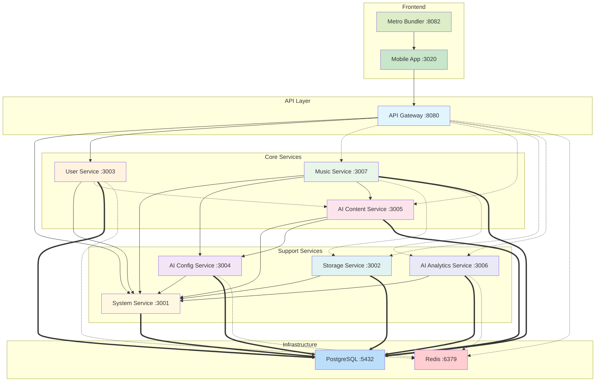
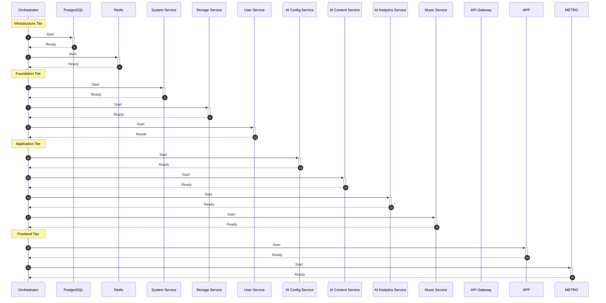

# Service Dependencies

> Auto-generated from `packages/platform-core/src/config/services-definition.ts`
> 
> Last updated: 2026-01-25

## Dependency Graph



### Legend

- **Solid arrows (-->)**: Required dependency
- **Dashed arrows (-.->)**: Optional dependency  
- **Thick arrows (==>)**: Database connection

## Service Configuration

| Service | Port | Tier | Dependencies | Required Resources |
|---------|------|------|--------------|--------------------|
| system-service | 3001 | foundation | - | postgresql |
| storage-service | 3002 | foundation | system-service | postgresql |
| user-service | 3003 | foundation | system-service, ai-content-service (opt) | postgresql, redis |
| ai-config-service | 3004 | application | system-service | postgresql, redis (opt) |
| ai-content-service | 3005 | application | system-service, ai-config-service | postgresql |
| ai-analytics-service | 3006 | application | system-service | postgresql, redis (opt) |
| music-service | 3007 | application | system-service, ai-config-service, ai-content-service, storage-service (opt), ai-analytics-service (opt) | postgresql |
| api-gateway | 8080 | application | system-service, user-service, music-service (opt), ai-content-service (opt), storage-service (opt), ai-analytics-service (opt) | redis |


## Startup Order

Services are started in tiers to ensure dependencies are ready:


### 1. Infrastructure Tier

- **postgresql** (:5432)
- **redis** (:6379)


### 2. Foundation Tier

- **system-service** (:3001)
- **storage-service** (:3002)
- **user-service** (:3003)


### 3. Application Tier

- **ai-config-service** (:3004)
- **ai-content-service** (:3005)
- **ai-analytics-service** (:3006)
- **music-service** (:3007)
- **api-gateway** (:8080)


### 4. Frontend Tier

- **aiponge** (:3020)
- **aiponge-metro** (:8082)


## Startup Sequence



## Validation Status

✅ **All dependencies valid**


## Health Check Documentation

All backend services expose Kubernetes-compatible health endpoints:

| Endpoint | Purpose | Expected Response |
|----------|---------|-------------------|
| `/health` | Detailed health status | Full component health with dependencies |
| `/health/live` | Liveness probe | 200 if process is running |
| `/health/ready` | Readiness probe | 200 if ready to accept traffic |
| `/health/startup` | Startup probe | 200 once initialization complete |

### Health Check Configuration

```yaml
# Kubernetes probe configuration
livenessProbe:
  httpGet:
    path: /health/live
    port: 3001
  initialDelaySeconds: 10
  periodSeconds: 15
  timeoutSeconds: 5
  failureThreshold: 3

readinessProbe:
  httpGet:
    path: /health/ready
    port: 3001
  initialDelaySeconds: 5
  periodSeconds: 10
  timeoutSeconds: 5
  failureThreshold: 3

startupProbe:
  httpGet:
    path: /health/startup
    port: 3001
  initialDelaySeconds: 0
  periodSeconds: 5
  timeoutSeconds: 5
  failureThreshold: 30  # Allow up to 150s for startup
```

### Service-Specific Health Checks

| Service | Port | Startup Endpoint | Live Endpoint | Startup Timeout |
|---------|------|------------------|---------------|------------------|
| system-service | 3001 | `/health/startup` | `/health` | 30s |
| storage-service | 3002 | `/health/startup` | `/health` | 60s |
| user-service | 3003 | `/health/startup` | `/health` | 60s |
| ai-config-service | 3004 | `/health/startup` | `/health` | 60s |
| ai-content-service | 3005 | `/health/startup` | `/health` | 60s |
| ai-analytics-service | 3006 | `/health/startup` | `/health` | 60s |
| music-service | 3007 | `/health/startup` | `/health` | 60s |
| api-gateway | 8080 | `/health/startup` | `/health` | 60s |


## Scaling Guidelines

### Horizontal Pod Autoscaling

| Service | Min Replicas | Max Replicas | CPU Target | Memory Target |
|---------|--------------|--------------|------------|---------------|
| api-gateway | 2 | 10 | 70% | 80% |
| user-service | 2 | 8 | 70% | 75% |
| music-service | 2 | 12 | 60% | 70% |
| ai-content-service | 2 | 8 | 65% | 75% |
| ai-config-service | 1 | 4 | 50% | 70% |
| ai-analytics-service | 1 | 4 | 60% | 75% |
| storage-service | 2 | 6 | 70% | 80% |
| system-service | 1 | 3 | 50% | 70% |

### Resource Requests/Limits

```yaml
# High-traffic services (api-gateway, music-service)
resources:
  requests:
    cpu: "250m"
    memory: "512Mi"
  limits:
    cpu: "1000m"
    memory: "1Gi"

# Standard services (user-service, ai-content-service)
resources:
  requests:
    cpu: "100m"
    memory: "256Mi"
  limits:
    cpu: "500m"
    memory: "512Mi"

# Low-traffic services (system-service, ai-config-service)
resources:
  requests:
    cpu: "50m"
    memory: "128Mi"
  limits:
    cpu: "250m"
    memory: "256Mi"
```

### Scaling Triggers

- **API Gateway**: Scale on request rate > 1000 req/s per pod
- **Music Service**: Scale on active song generation jobs > 10 per pod
- **AI Content Service**: Scale on prompt queue depth > 50
- **User Service**: Scale on concurrent sessions > 500 per pod

## Failure Modes & Recovery

### Service Failure Matrix

| Failed Service | Impact | Degraded Functionality | Recovery Action |
|----------------|--------|------------------------|-----------------|
| **api-gateway** | Critical | Complete outage | Immediate failover to standby |
| **user-service** | Critical | No auth, no user data | Scale up replicas, check DB |
| **music-service** | High | No music generation/playback | Retry with backoff, check AI providers |
| **ai-content-service** | High | No AI-generated content | Queue requests, use cached responses |
| **ai-config-service** | Medium | Stale AI configs | Use cached configs, alert ops |
| **ai-analytics-service** | Low | No analytics tracking | Queue events, async retry |
| **storage-service** | Medium | No file uploads | Queue uploads, check storage providers |
| **system-service** | High | No config, no health data | Check DB connection, restart |

### Dependency Failure Handling

| Dependency | Failure Detection | Fallback Strategy |
|------------|-------------------|-------------------|
| PostgreSQL | Connection timeout 5s | Read replicas, cached data |
| Redis | Connection timeout 2s | In-memory cache, graceful degradation |
| External AI APIs | Circuit breaker open | Queue requests, use fallback provider |
| Storage Providers | Upload timeout 30s | Retry with exponential backoff |

### Recovery Procedures

1. **Single Service Crash**
   - Kubernetes restarts pod automatically
   - Health checks gate traffic until ready
   - No manual intervention needed

2. **Database Failover**
   - Automatic failover to read replica
   - Write operations queued
   - Alert ops for manual promotion

3. **Redis Outage**
   - Fall back to in-memory caching
   - Rate limiting uses local counters
   - Session validation degrades gracefully

4. **Complete Cluster Failure**
   - Traffic redirected via DNS to DR cluster
   - Database restored from latest snapshot
   - Services start in tier order

## Circuit Breaker Configuration

### Circuit Breaker States

```
CLOSED → (failures exceed threshold) → OPEN
OPEN → (timeout expires) → HALF_OPEN
HALF_OPEN → (probe succeeds) → CLOSED
HALF_OPEN → (probe fails) → OPEN
```

### Default Configuration

```typescript
const circuitBreakerDefaults = {
  failureThreshold: 5,        // Failures before opening
  successThreshold: 3,        // Successes to close from half-open
  timeout: 30000,             // Time in OPEN state before half-open (ms)
  volumeThreshold: 10,        // Min requests before circuit activates
  errorFilter: (error) => {   // Which errors count as failures
    return error.status >= 500 || error.code === 'ECONNREFUSED';
  },
};
```

### Service-Specific Overrides

| Service Call | Failure Threshold | Timeout | Notes |
|--------------|-------------------|---------|-------|
| AI Provider APIs | 3 | 60s | High latency expected |
| Music Generation | 3 | 120s | Long-running operations |
| Database queries | 5 | 10s | Fast fail, retry elsewhere |
| Redis operations | 10 | 5s | High volume, tolerant |
| Storage uploads | 3 | 30s | Large payloads |

### Monitoring Circuit State

```bash
# Check circuit breaker status via admin API
curl -H "Authorization: Bearer $ADMIN_TOKEN" \
  https://api.aiponge.com/api/admin/health/circuits

# Response:
{
  "circuits": {
    "music-service→ai-content-service": { "state": "CLOSED", "failures": 0 },
    "ai-content-service→openai": { "state": "HALF_OPEN", "failures": 3 },
    "api-gateway→music-service": { "state": "CLOSED", "failures": 0 }
  }
}
```

## Quick Reference

### Port Assignments

| Port Range | Purpose |
|------------|---------|
| 3001-3007 | Backend Services |
| 3020 | Mobile App (Dev) |
| 5432 | PostgreSQL |
| 6379 | Redis |
| 8080 | API Gateway |
| 8081-8082 | Expo/Metro |

### Service URLs (Development)

```bash
# Core Services
API_GATEWAY_URL=http://localhost:8080
USER_SERVICE_URL=http://localhost:3003
MUSIC_SERVICE_URL=http://localhost:3007

# Support Services
SYSTEM_SERVICE_URL=http://localhost:3001
STORAGE_SERVICE_URL=http://localhost:3002
AI_CONFIG_SERVICE_URL=http://localhost:3004
AI_CONTENT_SERVICE_URL=http://localhost:3005
AI_ANALYTICS_SERVICE_URL=http://localhost:3006
```

### Alerting Thresholds

| Metric | Warning | Critical |
|--------|---------|----------|
| Error Rate | > 1% | > 5% |
| P99 Latency | > 2s | > 5s |
| CPU Usage | > 70% | > 90% |
| Memory Usage | > 75% | > 90% |
| Circuit Open Events | > 1/hr | > 5/hr |
| Failed Health Checks | > 2 consecutive | > 5 consecutive |

---

*Generated by `scripts/generate-dependency-graph.ts`*
